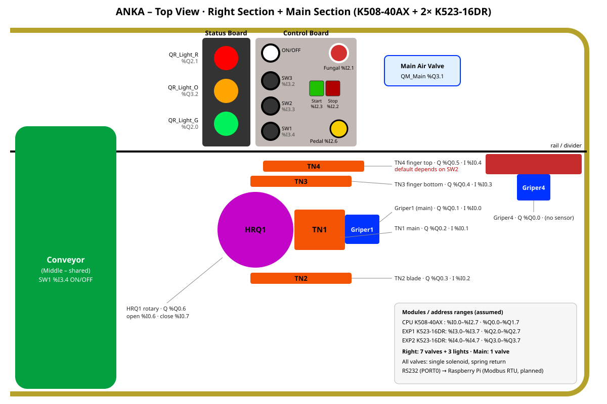

# پروژه PLC دستگاه ANKA

## سخت‌افزار

| ماژول | مدل | ورودی‌ها | خروجی‌ها |
|---|---|---|---|
| CPU | Kinco K508-40AX | `%I0.0` – `%I2.7` (۲۴ ورودی) | `%Q0.0` – `%Q1.7` (۱۶ خروجی) |
| ماژول توسعه ۱ | K523-16DR (رله) | `%I3.0` – `%I3.7` | `%Q2.0` – `%Q2.7` |
| ماژول توسعه ۲ | K523-16DR (رله) | `%I4.0` – `%I4.7` | `%Q3.0` – `%Q3.7` |
| ارتباط (برنامه‌ریزی‌شده) | Raspberry Pi | از طریق RS232 (PORT0)، احتمالاً با Modbus RTU | |

> آدرس‌دهی ماژول‌های توسعه فرض شده است (بر اساس ترتیب نصب پشت CPU). لطفاً در KincoBuilder
> (بخش Hardware Configuration) بررسی کنید.

## بخش‌های دستگاه

| بخش | نوع | وضعیت |
|---|---|---|
| سمت راست | مجزا | **در حال کار** — ۷ شیر برقی + ۳ چراغ وضعیت |
| سمت چپ | مجزا | بعداً |
| میانی (نوار نقاله) | مشترک | بعداً (SW1 روشن/خاموش نقاله) |
| اصلی / کنترلی | مشترک | **در حال کار** — ۱ شیر برقی اصلی هوا |

همه شیرهای برقی تک‌بوبین با برگشت فنری هستند: با وصل شدن خروجی پیستون حرکت می‌کند و با قطع شدن به حالت قبل برمی‌گردد.

## نقشه ورودی/خروجی

جدول کامل نمادها: [`tags/symbols_right_main.csv`](tags/symbols_right_main.csv)
(خروجی خام KincoBuilder هم در [`tags/symbols_right_main_kincobuilder_raw.txt`](tags/symbols_right_main_kincobuilder_raw.txt) نگه داشته شده است).

### خروجی‌های سمت راست

| نماد | آدرس | عملگر | نوع | حالت پیش‌فرض | سنسور |
|---|---|---|---|---|---|
| `QR_Griper4` | `%Q0.0` | گریپر ۴ | گریپر | باز | — |
| `QR_Griper_1` | `%Q0.1` | گریپر ۱ (اصلی) | گریپر | باز | `I_Griper1` `%I0.0` |
| `QR_TN1` | `%Q0.2` | TN1 پیستون اصلی | پیستون | بسته | `I_TN1` `%I0.1` |
| `QR_TN2` | `%Q0.3` | TN2 تیغه | پیستون | بسته | `I_TN2` `%I0.2` |
| `QR_TN3` | `%Q0.4` | TN3 انگشتی پایین | پیستون | بسته | `I_TN3` `%I0.3` |
| `QR_TN4` | `%Q0.5` | TN4 انگشتی بالا | پیستون | وابسته به SW2 | `I_TN4` `%I0.4` |
| `QR_HRQ1` | `%Q0.6` | HRQ1 بازوی روتاری | روتاری | بسته | `I_HRQ1_O` `%I0.6` / `I_HRQ1_C` `%I0.7` |
| `QR_Light_G` | `%Q2.0` | چراغ سبز | چراغ | — | |
| `QR_Light_R` | `%Q2.1` | چراغ قرمز | چراغ | — | |
| `QR_Light_O` | `%Q3.2` | چراغ نارنجی | چراغ | — | |

### بخش اصلی

| نماد | آدرس | توضیح |
|---|---|---|
| `QM_Main` | `%Q3.1` | شیر برقی اصلی هوای کل دستگاه |
| `S_FungalButton` | `%I2.1` | شاسی قارچی (توقف اضطراری) |
| `SW1` | `%I3.4` | کلید روشن/خاموش نوار نقاله |
| `SW2` | `%I3.3` | کلید تغییر حالت پیوند (Grafting mode) |
| `SW3` | `%I3.2` | رزرو |

### ورودی‌های اپراتور سمت راست

| نماد | آدرس | توضیح |
|---|---|---|
| `S_StopRight` | `%I2.2` | شاسی توقف راست |
| `S_StartRight` | `%I2.3` | شاسی استارت راست |
| `S_PedalRight` | `%I2.6` | پدال راست |
| `MStart_Right` | `%M0.0` | حافظه استارت راست |

## شمای دستگاه

## نکات و سوالات باز (قبل از نوشتن منطق)

1. **شاسی قارچی:** سیم‌کشی آن NC است یا NO؟ برای ایمنی NC توصیه می‌شود (قطع سیم = توقف).
2. **نام‌گذاری گریپر:** نماد `I_Griper1` است ولی توضیحش «Sensor Griper 2 (MainGriper)» است. کدام درست است؟
3. **سنسورها:** هر سنسور (غیر از HRQ1) کدام انتهای کورس پیستون را تشخیص می‌دهد؟ (حالت کارکرده یا حالت استراحت)
4. **گریپر ۴** سنسور ندارد؛ برای آن از تاخیر زمانی (تایمر) استفاده کنیم؟
5. **TN4 و SW2:** در هر حالت SW2، پیش‌فرض TN4 چه باشد؟
6. **منطق چراغ‌ها:** سبز/نارنجی/قرمز هر کدام در چه وضعیتی روشن شوند (آماده، در حال کار، خطا، اضطراری)؟
7. **ترتیب کار (Sequence):** مراحل سیکل کاری سمت راست پس از استارت یا پدال به ترتیب.
8. `%I0.5` خالی است — برای سنسور آینده رزرو شود؟
